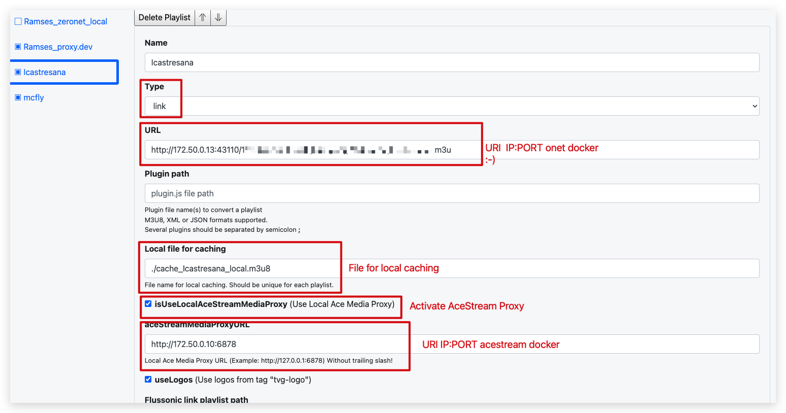

# HLSProxy

````
cd hlsproxy
docker build -t hlsproxy:arm .
docker compose up -d
````

## How to configure

Admin URI: http://<your_docker>:38050/login

```
admin
changemerightnow
```
Change the password

Now, add your remote m3u8, from 0net or other system



Save the changes

I recomend add user clients and use the token uri for your favorite app

Example URI: http://<your_ip>:38050/playlist.m3u8?q=eyJ1c2VySWQiOiJ0aHJlYWRmaW4ifQ.ZesAKNdP2H-qwbO1Mvb8MGJ2GrUVBSZaNz6gTb9bAy32ludrb-L1mCv9tLh0xF1VNHJb2IF5tz54u5yX6ttTug

